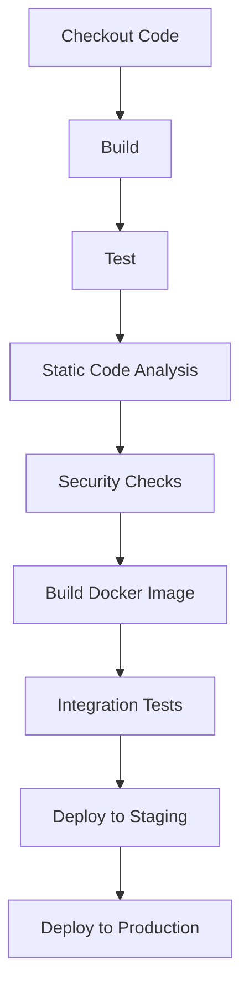

```mermaid
flowchart TD
    A[Checkout Code] --> B[Build]
    B --> C[Test]
    C --> D[Static Code Analysis]
    D --> E[Security Checks]
    E --> F[Build Docker Image]
    F --> G[Integration Tests]
    G --> H[Deploy to Staging]
    H --> I[Deploy to Production]
```
